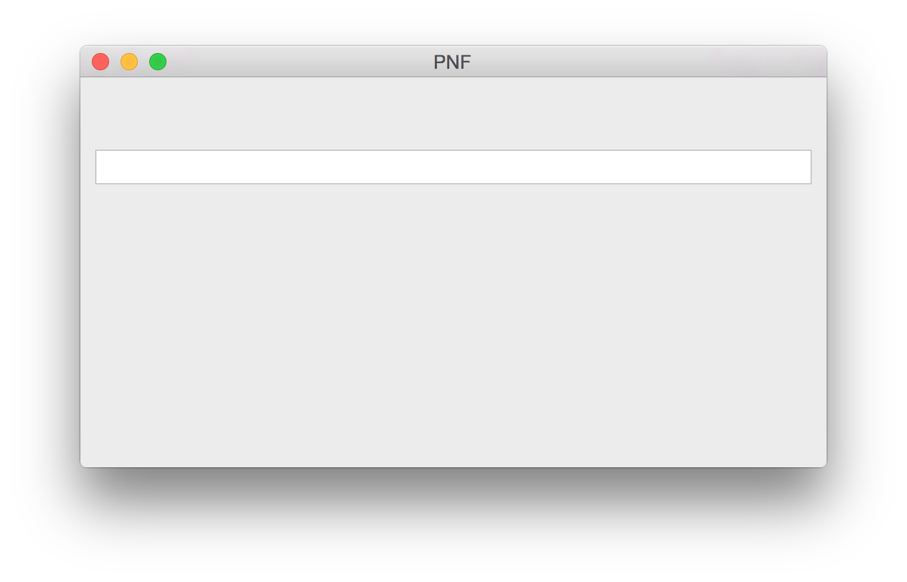
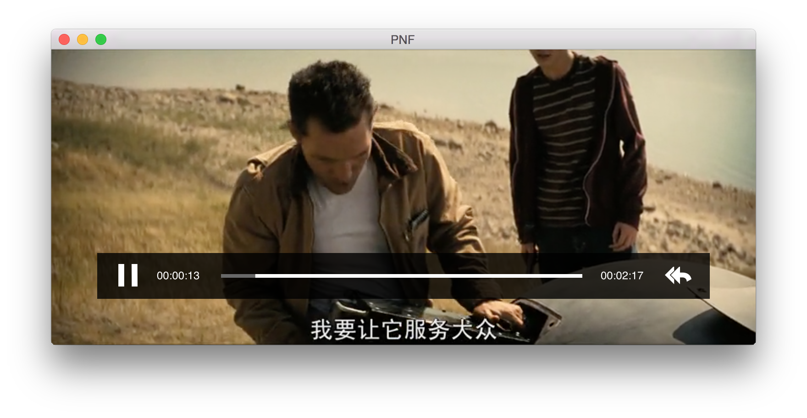

PNF
===

Player Is Not Flash

PNF aimed at Replacing Flash on OSX

PNF旨在于解决Mac OSX上播放Flash时CPU温度过高的问题。PNF使用AVPlayer播放HLS流文件。

PNF支持直接输入URL（回车）播放，和拖到链接到PNF窗口两种播放方式。

例如：粘贴网页播放地址 http://v.youku.com/v_show/id_XNzYzODM1Nzk2.html 播放。

PNF模拟iOS设备UA，使用Javascript获取播放地址（m3u8）。目前支持播放优酷、搜狐视频、爱奇艺、乐视、Youtube网页链接。可以通过Edit->Configuration，添加（或替换）配置支持其他网站。配置格式如下：

```
[
 {
  "domain":"http://www.youku.com",
  "JS":"document.getElementById('youku-html5player-video').src",
  "website":"优酷"
 }
]
```

由于JS水平有限，欢迎提交JS代码。

截图





[下载](https://github.com/flexih/PNF/releases)
 
